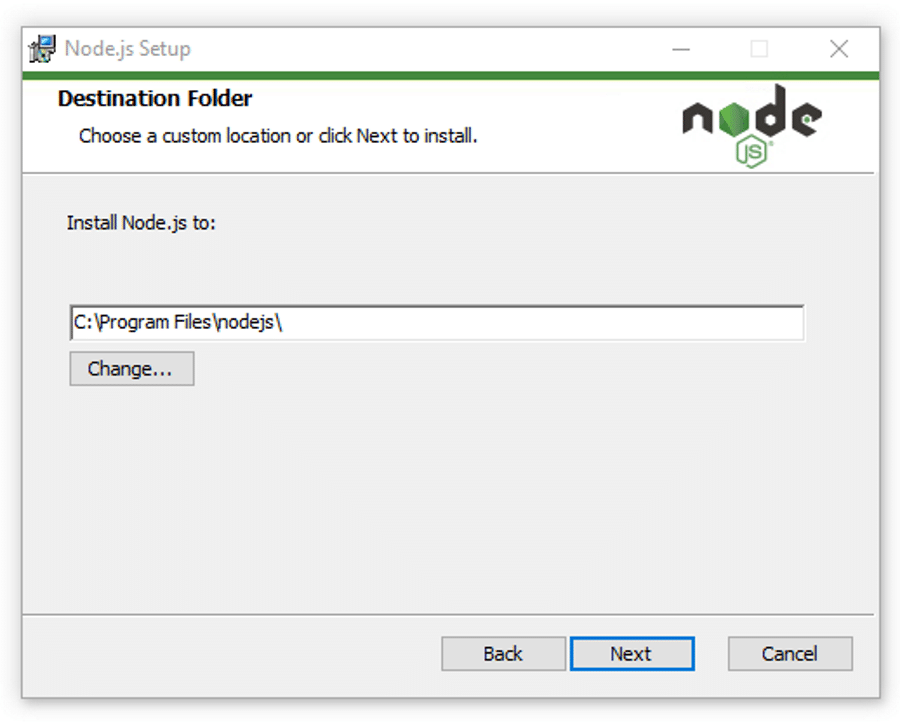
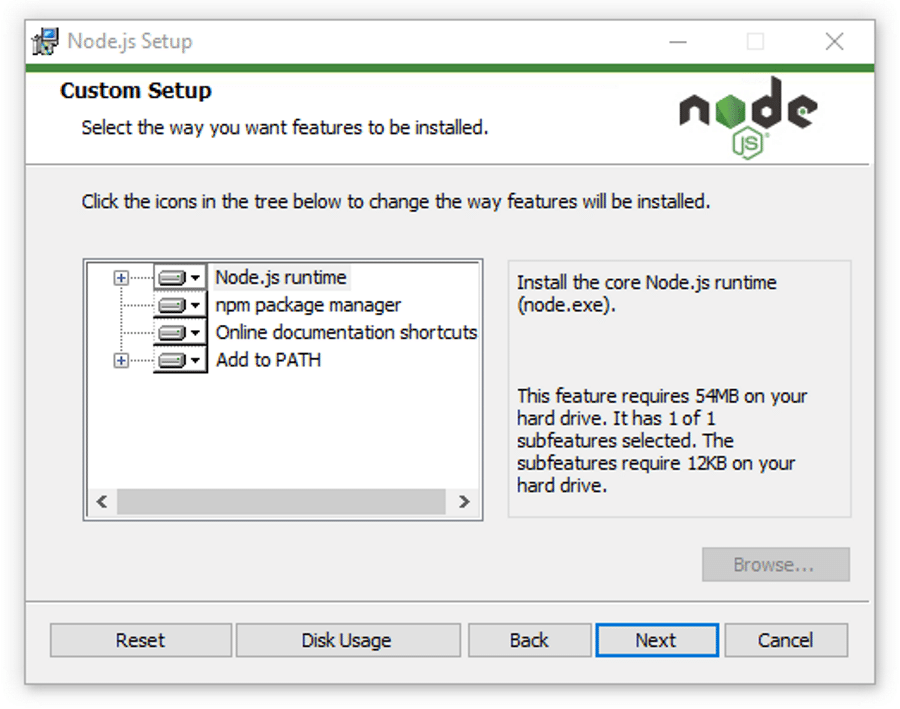
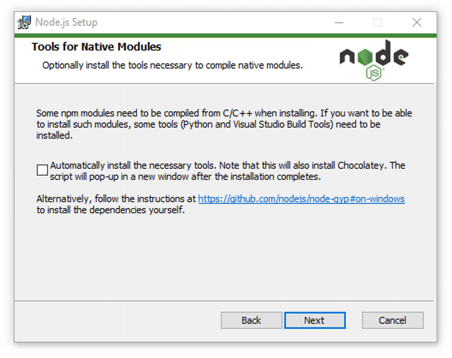

# User Manager


## Getting started

To make it easy for you to get started with GitLab, here's a list of recommended next steps.

Already a pro? Just edit this README.md and make it your own. Want to make it easy? [Use the template at the bottom](#editing-this-readme)!

## Add your files

- [ ] [Create](https://docs.gitlab.com/ee/user/project/repository/web_editor.html#create-a-file) or [upload](https://docs.gitlab.com/ee/user/project/repository/web_editor.html#upload-a-file) files
- [ ] [Add files using the command line](https://docs.gitlab.com/ee/gitlab-basics/add-file.html#add-a-file-using-the-command-line) or push an existing Git repository with the following command:

```
cd existing_repo
git remote add origin https://git.chalmers.se/courses/dit355/dit356-2022/t-8/user-manager.git
git branch -M main
git push -uf origin main
```

## Integrate with your tools

- [ ] [Set up project integrations](https://git.chalmers.se/courses/dit355/dit356-2022/t-8/user-manager/-/settings/integrations)

## Collaborate with your team

- [ ] [Invite team members and collaborators](https://docs.gitlab.com/ee/user/project/members/)
- [ ] [Create a new merge request](https://docs.gitlab.com/ee/user/project/merge_requests/creating_merge_requests.html)
- [ ] [Automatically close issues from merge requests](https://docs.gitlab.com/ee/user/project/issues/managing_issues.html#closing-issues-automatically)
- [ ] [Enable merge request approvals](https://docs.gitlab.com/ee/user/project/merge_requests/approvals/)
- [ ] [Automatically merge when pipeline succeeds](https://docs.gitlab.com/ee/user/project/merge_requests/merge_when_pipeline_succeeds.html)

## Test and Deploy

Use the built-in continuous integration in GitLab.

- [ ] [Get started with GitLab CI/CD](https://docs.gitlab.com/ee/ci/quick_start/index.html)
- [ ] [Analyze your code for known vulnerabilities with Static Application Security Testing(SAST)](https://docs.gitlab.com/ee/user/application_security/sast/)
- [ ] [Deploy to Kubernetes, Amazon EC2, or Amazon ECS using Auto Deploy](https://docs.gitlab.com/ee/topics/autodevops/requirements.html)
- [ ] [Use pull-based deployments for improved Kubernetes management](https://docs.gitlab.com/ee/user/clusters/agent/)
- [ ] [Set up protected environments](https://docs.gitlab.com/ee/ci/environments/protected_environments.html)

***

# Editing this README

When you're ready to make this README your own, just edit this file and use the handy template below (or feel free to structure it however you want - this is just a starting point!). Thank you to [makeareadme.com](https://www.makeareadme.com/) for this template.

## Suggestions for a good README
Every project is different, so consider which of these sections apply to yours. The sections used in the template are suggestions for most open source projects. Also keep in mind that while a README can be too long and detailed, too long is better than too short. If you think your README is too long, consider utilizing another form of documentation rather than cutting out information.

## Dentistimo Security
This is the security component of group eights [Dentistimo](https://git.chalmers.se/courses/dit355/dit356-2022/t-8/documentation) system. Dentistimo is a distributed system which allows users to book dentist appointments in the Gothenburg region and allows for more clinics to be added in the future. This repository contains the security component which is responsible for authenticating messages sent by other components of the system. This is done through the use of [MQTT](https://mqtt.org/) and [jsonwebtoken](https://jwt.io/). Messages which have not been checked by this component are recieved through mqtt and then, if the message has a token inside it, it checks the authenticity of the message. If the message has a valid token, it is sent to the backend. If the message does not have a valid token, it is sent back to the source with an error message. The security component provides the following functionalities:
 
- receive mqtt messages with the topic "unauthenticated"
- parse mqtt messages
- verify jsonwebtoken
- retrieve user data from a jsonwebtoken
- publish mqtt messages
- handle no token error
- handle invalid token error
- Change authentication status of a request

## Badges
On some READMEs, you may see small images that convey metadata, such as whether or not all the tests are passing for the project. You can use Shields to add some to your README. Many services also have instructions for adding a badge.

## Visuals
Depending on what you are making, it can be a good idea to include screenshots or even a video (you'll frequently see GIFs rather than actual videos). Tools like ttygif can help, but check out Asciinema for a more sophisticated method.

## Installation
In order to run the component you need to have the project on your computer, node.js installed and mosquito installed.
- The first step is installing [node.js](https://nodejs.org/en/download/), what version you should download depends on your operating system (this guide will show the process for windows, if you're using mac or linux you can check out [this](https://kinsta.com/blog/how-to-install-node-js/) guide which explains that process as well)
  - Double click the .msi file in order to begin the installation process
 
&nbsp;
&nbsp;
 

 
*Click on next.*
 
&nbsp;
 

 
*select the destination where you want to install Node.js. If you don’t want to change the directory, go with the Windows default location and click the Next button again.*
 
&nbsp;
 

 
*If you want a standard installation with the Node.js default features, click the Next button. Otherwise, you can select your specific elements from the icons in the tree before clicking Next.*
 
&nbsp;
 

 
*Node.js offers you options to install tools for native modules. If you’re interested in these, click the checkbox to mark your preferences, or click Next to move forward with the default.*
 
&nbsp;
 

 
*Click install, this can take a couple of minutes*
 
&nbsp;
 
  - Once you have finished the installation you can verify it by opening the [CMD](https://www.lifewire.com/command-prompt-2625840) and typing:
 
  >```node --version```
 
  - You can also check npm by typing:
 
  >```npm --version```
 
  If node has been correctly installed you should see the version name in the CMD prompt
 
&nbsp;

- The next step is to download the project .zip file or pull the project with [git](https://git-scm.com/), if you have that installed.
 
- Extract the project files from the .zip and put them in a place you can easily find, example:
  >C:\Users\name\Desktop\security
 
- open the [CMD](https://www.lifewire.com/command-prompt-2625840) and go to the directory where you put the files. This can be done by typing cd + the file path. If I put my files in C:\Users\name\Desktop\security I would type:
  >cd C:\Users\name\Desktop\security

- Type:
  >npm install
 
- Once all dependencies have been installed, type the command
  >npm start
 
If everything is installed correctly and running as it should you should see something like this
 
 

## Usage
The main use of the security is to be a safety net which checks if the client has a token when sending requests.

Use examples liberally, and show the expected output if you can. It's helpful to have inline the smallest example of usage that you can demonstrate, while providing links to more sophisticated examples if they are too long to reasonably include in the README.

## Support
Tell people where they can go to for help. It can be any combination of an issue tracker, a chat room, an email address, etc.

## Roadmap
If you have ideas for releases in the future, it is a good idea to list them in the README.

## Contributing
State if you are open to contributions and what your requirements are for accepting them.

For people who want to make changes to your project, it's helpful to have some documentation on how to get started. Perhaps there is a script that they should run or some environment variables that they need to set. Make these steps explicit. These instructions could also be useful to your future self.

You can also document commands to lint the code or run tests. These steps help to ensure high code quality and reduce the likelihood that the changes inadvertently break something. Having instructions for running tests is especially helpful if it requires external setup, such as starting a Selenium server for testing in a browser.

## Authors and acknowledgment
Show your appreciation to those who have contributed to the project.

## License
For open source projects, say how it is licensed.

## Project status
If you have run out of energy or time for your project, put a note at the top of the README saying that development has slowed down or stopped completely. Someone may choose to fork your project or volunteer to step in as a maintainer or owner, allowing your project to keep going. You can also make an explicit request for maintainers.
